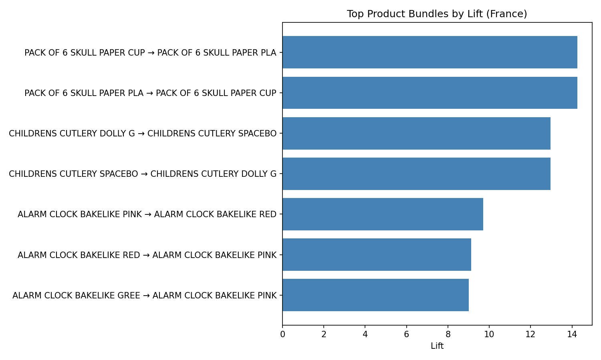
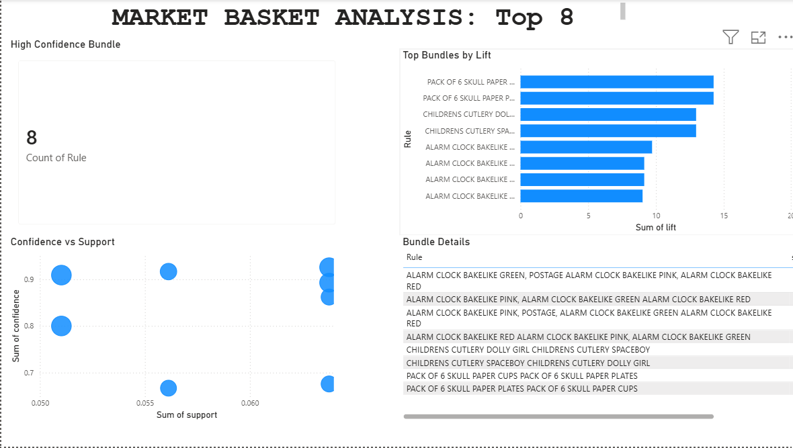

# Market Basket Analysis for Retail Strategy

Association rule mining on 541,909 real retail transactions to uncover which products are bought together, producing high-confidence cross-sell bundles.

## Dataset

[Online Retail dataset — UCI Machine Learning Repository](https://archive.ics.uci.edu/dataset/352/online+retail): transactions from a UK-based online retailer (Dec 2010 – Dec 2011).

**Data volume:**
- Raw: **541,909 rows × 8 columns**
- After cleaning: **530,693 rows** (11,216 removed — ~2%)
- French market focus: **392 baskets × 1,563 products**
- High-confidence bundles identified: **8** (confidence ≥ 65%, lift > 1)

## Method

1. **Cleaning (Pandas):** Removed cancelled orders, missing product names, negative quantities, and whitespace inconsistencies
2. **Basket encoding:** Pivoted invoices × products into a boolean basket matrix
3. **Apriori algorithm (MLxtend):** Mined frequent itemsets at 5% minimum support threshold
4. **Association rules:** Generated and ranked by support, confidence, and lift
5. **Filtering:** Kept only bundles with ≥65% confidence and lift > 1
6. **Visualisation:** Exported rules to CSV for Power BI reporting

## Key Results

**8 high-confidence product bundles**, with the strongest showing a lift of **14.25** — meaning those products are bought together over 14 times more often than chance would predict.

The patterns are commercially coherent:

- **Matching items:** Pack of 6 Skull Paper Cups ↔ Pack of 6 Skull Paper Plates
- **Product variants:** Children's Cutlery Dolly Girl ↔ Children's Cutlery Spaceboy
- **Colour variants:** Alarm Clock Bakelike series — customers buy multiple colours together

**Business implications:**
- **Cross-sell at checkout:** Recommend the paired product when customers add the first item
- **Co-location:** Display these pairs together on shelves or online
- **Inventory management:** Treat linked pairs as a unit — a stockout of one risks losing both sales
- **Promotional bundling:** Build promotions from evidence, not intuition

## Power BI Report

Interactive dashboard built from the exported association rules, showing:
- **Card:** Count of high-confidence bundles (8)
- **Bar chart:** Top bundles ranked by lift (strength of relationship)
- **Scatter plot:** Confidence vs support, bubble size = lift (pattern reliability)
- **Table:** Bundle details with support, confidence, and lift metrics

**Cross-filtering enabled:** Click any bar or point to filter all visuals.

Source file: `market_basket_powerbi.pbix` (open with Power BI Desktop to interact)

## Tech Stack

**Data processing:** Python · Pandas · NumPy  
**Algorithm:** MLxtend (Apriori, Association Rules)  
**Visualisation:** Matplotlib (charts) · Power BI (interactive dashboard)

## Files

- `market_basket_analysis.ipynb` — full analysis notebook (Google Colab)
- `association_rules.csv` — exported rules (Power BI input)
- `top_bundles.png` — bar chart of top 8 bundles by lift
- `powerbi_dashboard.png` — screenshot of interactive Power BI report
- `market_basket_powerbi.pbix` — live Power BI file

## How to reproduce

1. Open `market_basket_analysis.ipynb` in Google Colab
2. Run cells 1–7 to clean the data, apply Apriori, and export rules
3. Download `association_rules.csv`
4. Load the CSV into Power BI Desktop, filter to confidence ≥ 0.65 and lift > 1, keep top 8 by lift
5. Build the four visuals as shown in `powerbi_dashboard.png`

## Learnings

- **Cleaning is everything:** 2% data removal was deliberate, documented, and defensible. The analysis is only as honest as the cleaning.
- **Threshold matters:** The 65% confidence cut prioritises safe recommendations over volume. Lowering it yields more bundles with lower reliability.
- **Association ≠ causation:** High lift shows real patterns, not causation. Seasonality or promotions could drive both purchases.
- **Scoping is a choice:** Analysing France alone reveals market-specific patterns. Replicating across other countries would test generalisability.

## Next steps

- Run the same analysis on other markets (UK, Netherlands) and compare patterns
- A/B test the top bundles: does displaying them together actually increase cross-sell conversion?
- Extend to temporal analysis: which bundles spike seasonally, and why?

---

**Built by Lois Opadeji** | [LinkedIn](https://linkedin.com/in/loisopadeji) | [GitHub](https://github.com/loisopadeji)
